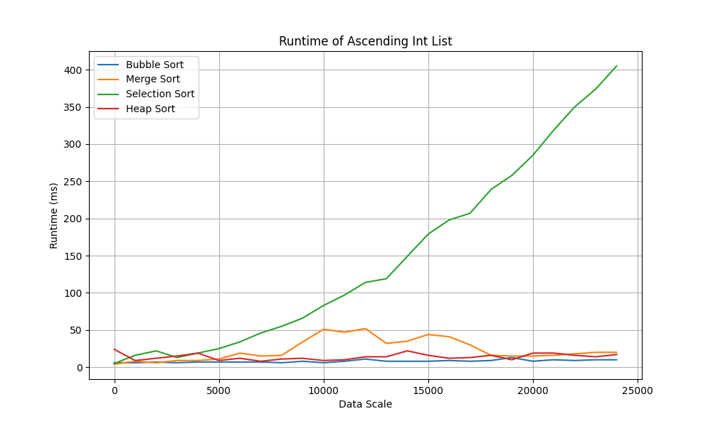
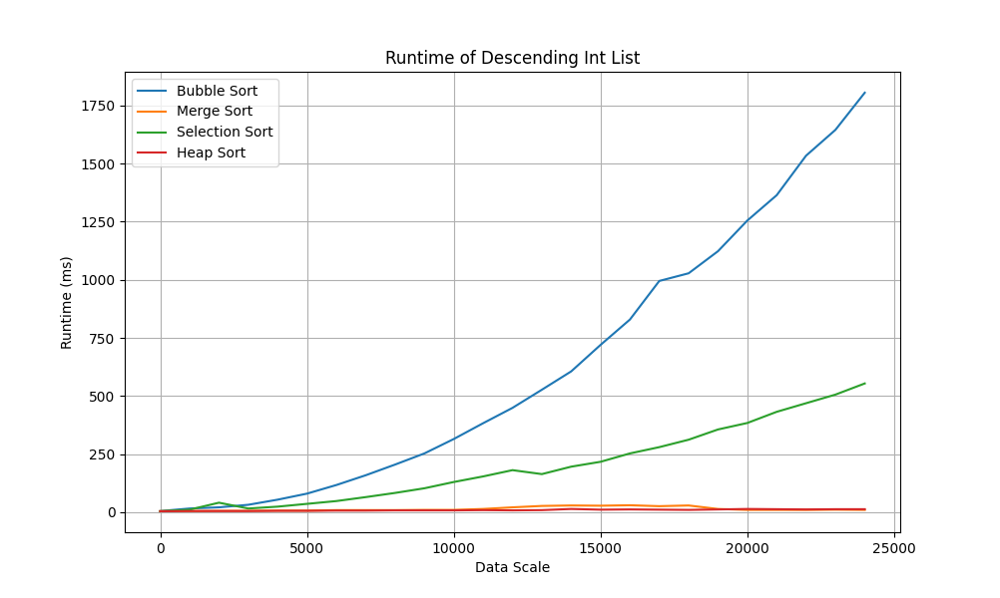
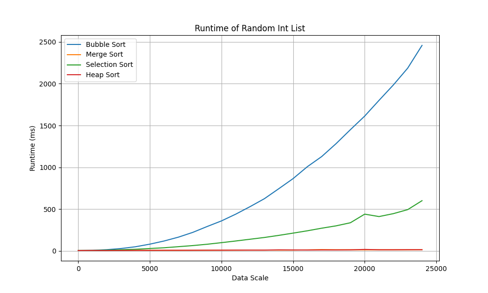
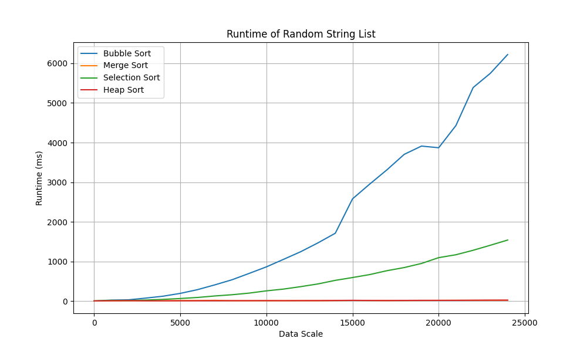
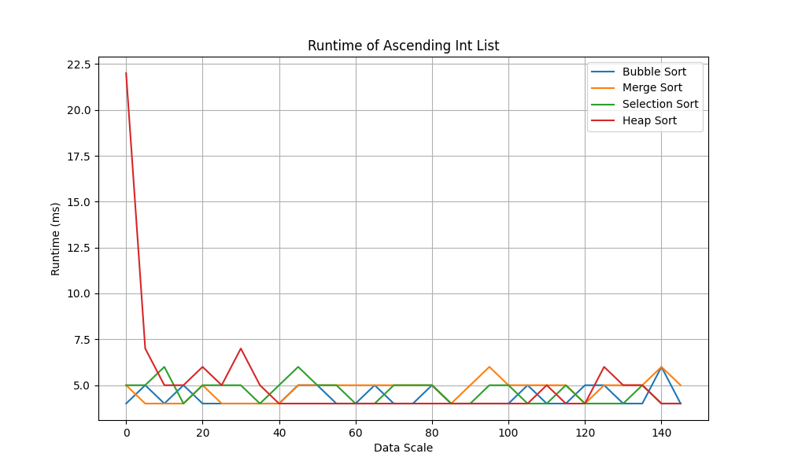
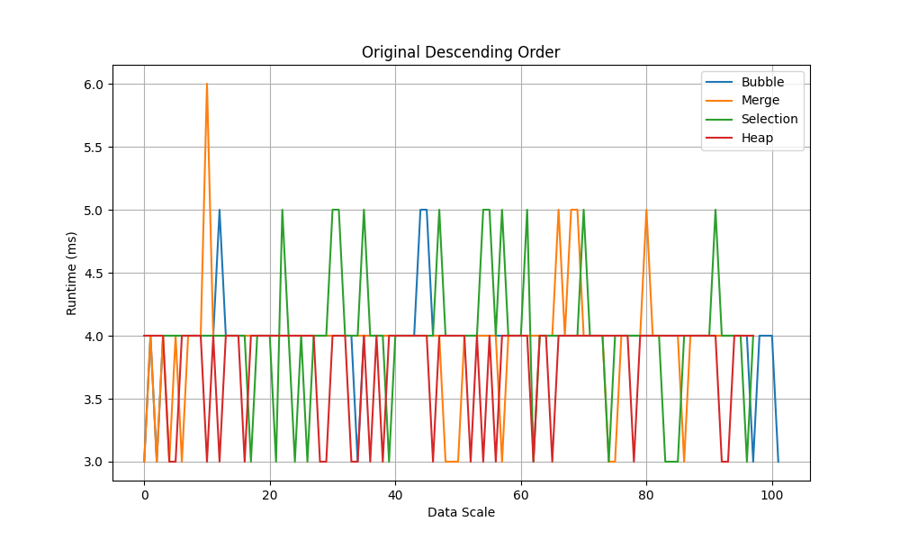
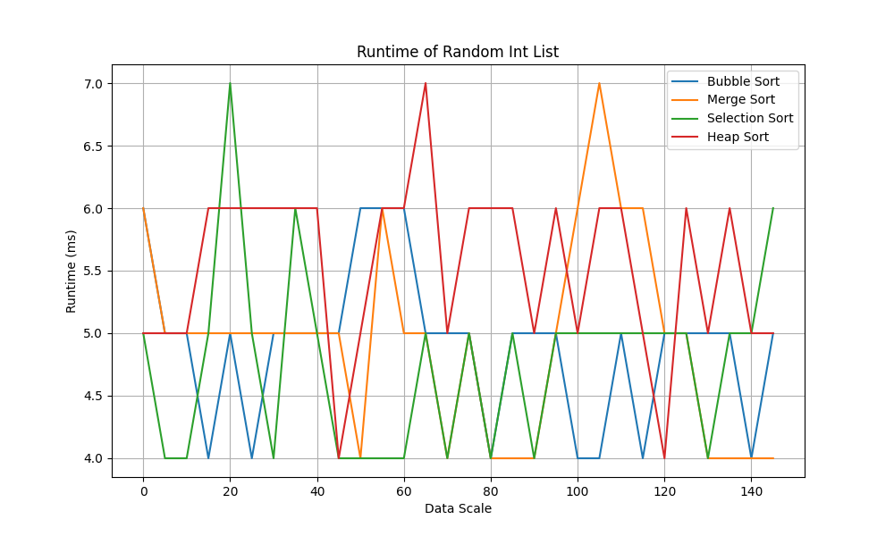
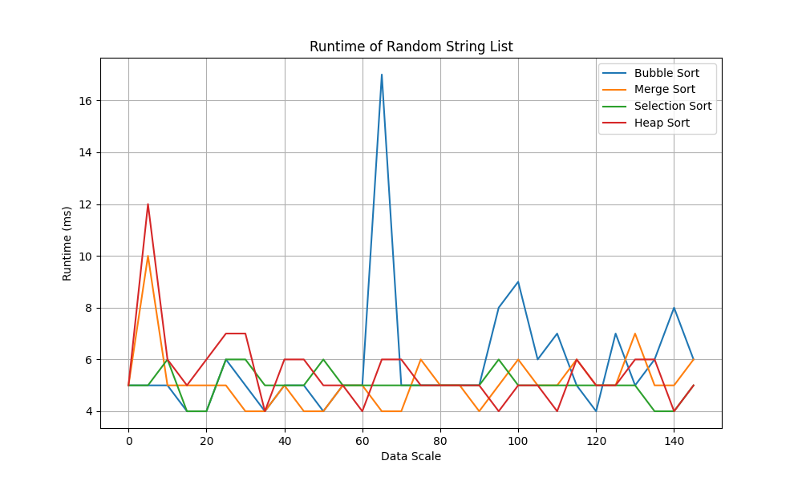

# Report
## Intro
Performance of four sorting methods are tested in this lab session, including bubble sort, selection sort, merge sort and heap sort. Data set of different lengths, types, and original order are prepared for testing, providing a more comprehensive insight of the performance.


## Result
### 1. Ascending Integer List




Merge and Heap sort hold runtime complexity of $O(n log n)$ under any cases, showing a good and stable performance in different scenarios. 

Theoretically, bubble sorting under random case holds a complexity of $O(n^2)$. However, it leads to a complexity of $O(n)$ of bubble sort by giving the list of integers in ascending order already, as there is no need for swapping items when the list is already sorted.

Selection sort has a complexity of $O(n^2)$ in any cases, as well as the list with original ascending order. The ratio of growth of this algorithm burgeons at a great speed, which is nearly unusable in practice. Meanwhile, unlike bubble sort, selection sort doesn't improve in the best-case scenario because it always scans the entire array for the minimum element.


### 2. Descending Integer List



Even though that both bubble and selection sort have complexity of $O(n^2)$, it's still clear in the result that selection sort performs much better than bubble sort. The reason is that selection sort implements less swap operation compared to bubble. It only swap once for arranging the i-th smallest items, yet bubble sort need to do at most n-th times each time (n is the length of list).

Merge and heap sort, as mentioned before, performed really well as the average and worst-case complexity $O(n log n)$ indicated.

### 3. Random Integer List



Bubble sort performs worst in this case, as mentioned before, the reason is that the swapping operation need to be executed more times than selection sort although both the complexity is $O(n^2)$. And the random input reflects a better asymptote to average time complexity.

Merge and heap sort, even though contains a number of swap, still performs significantly better than other algorithms.

### 4. Radom String List



Being compare with other input types, `String` is a reference type, requiring one more step of referencing the memory location when doing swap or any other assignment. Therefore, the run time of each algorithm is much greater than what they performed in other cases.

### 5. Small Size List

When the scale of the input is quite small, the timing comparison between different sorting algorithms may not show significant differences, especially for simple algorithms like bubble sort and selection sort. This is because their time complexities are quadratic, meaning they have poor performance for large datasets but can perform relatively well on small datasets.







### 6. Memory Consumption

* Bubble Sort

Bubble sort typically requires only a constant amount of additional memory because it sorts the array in place. It doesn't require any additional data structures besides the array itself. 
However, due to the limitation of its time complexity, the process is unusably slow that even after an hour of running, JVM still not pops memory overflow. The last log message indicates it could successfully sort array of size 524,288. 

* Selection Sort

Selection sort also sorts the array in place and doesn't require additional memory besides the array itself. Similar to bubble sort, it has a constant memory consumption. Same as mentioned before, the runtime is way too long to generate a overflow error, the last successful log is for list of size 1,048,576.

* Merge Sort

It requires additional memory location for arrays when recursively divide and sort the arrays. The number of sub-arrays is proportional to the array size because at the end of the day, the minimum arrays have fix length of 1. JVM could handle sorting of an array of size at most 33,554,432 before memory overflow occurs.

* Heap Sort

In a binary tree, each value is stores in a node structure, what the sorting does is swapping the references of different nodes in the tree. So it has a really good space complexity performance. As the result of really efficient runtime complexity, JVM reports a memory overflow error when sorting an array of size 47,554,432. The running time is 1m 58s.

## Code
> Reference: https://github.com/SoySauceZhu/CPT108

```Java
/* Generating different types of lists */
 
public static List<Integer> ascendingList(int num) {
    List<Integer> list = new ArrayList<>();
    for (int i = 0; i < num; i++) {
        list.add(2 * i + 1);
    }
    return list;
}

public static List<Integer> descendingList(int num) {
    List<Integer> list = new ArrayList<>();
    for (int i = 0; i < num; i++) {
        list.add(Integer.MAX_VALUE - 2 * i - 1);
    }
    return list;
}

public static List<Integer> randomList(int num) {
    List<Integer> list = new ArrayList<>();
    Random random = new Random(42);
    for (int i = 0; i < num; i++) {
        int a = random.nextInt(0, Integer.MAX_VALUE);
        list.add(a);
    }

    return list;
}

public static List<Integer> repeatedList(int num) {
    List<Integer> list = new ArrayList<>();
    Random random = new Random(42);
    if (num %2 == 1) num++;
    for (int i = 0; i < num / 2; i++) {
        int a = 51;
        list.add(a);
    }
    for (int i = 0; i < num / 2 - 1; i++) {
        int a = 49;
        list.add(a);
    }
    return list;
}

public static List<String > stringList(int num) {
    return (List<String>) StringDataGenerator.generateFixLengthRandomString(num, 10);
}
```
```java
/* Timing analysis */


/** Helper function that return the runtime of sorting a list (Collection)
 */
private static <T extends Comparable<? super T>> long timeOfSort(Sort sorter, Collection<T> input) {
    System.nanoTime();
    long start = System.nanoTime();
    sorter.sort(input);
    long end = System.nanoTime();
    return (end - start) / 1000000;
}


/** Helper function generating the List of runtime with 
 *  the name of corresponding sorter  
 */
public static Map<String, List<Long>> ascending() {

    Map<String, List<Long>> returnMap = new HashMap<>();

    for (int i = 3; i >= 0; i--) {

        Sort sorter = sorts.get(i);
        List<Long> list = new ArrayList<>();


        // The iteration time `j` could be revised for various cases

        for (int j = 1; j < 150; j += 5) {
            List<Integer> origin_data = DataPre.ascendingList(j);

            list.add(timeOfSort(sorter, origin_data));
        }
        returnMap.put(names.get(i), list);
    }

    return returnMap;

}

public static Map<String, List<Long>> descending() {

    Map<String, List<Long>> returnMap = new HashMap<>();

    for (int i = 3; i >= 0; i--) {

        Sort sorter = sorts.get(i);
        List<Long> list = new ArrayList<>();

        for (int j = 1; j < 150; j += 5) {
            List<Integer> origin_data = DataPre.descendingList(j);

            list.add(timeOfSort(sorter, origin_data));
        }
        returnMap.put(names.get(i), list);
    }

    return returnMap;

}

public static Map<String, List<Long>> random() {

    Map<String, List<Long>> returnMap = new HashMap<>();

    for (int i = 3; i >= 0; i--) {

        Sort sorter = sorts.get(i);
        List<Long> list = new ArrayList<>();

        for (int j = 1; j < 150; j += 5) {
            List<Integer> origin_data = DataPre.randomList(j);

            list.add(timeOfSort(sorter, origin_data));
        }
        returnMap.put(names.get(i), list);
    }

    return returnMap;

}

public static Map<String, List<Long>> repeated() {

    Map<String, List<Long>> returnMap = new HashMap<>();

    for (int i = 3; i >= 0; i--) {

        Sort sorter = sorts.get(i);
        List<Long> list = new ArrayList<>();

        for (int j = 1; j < 150; j += 5) {
            List<Integer> origin_data = DataPre.repeatedList(j);

            list.add(timeOfSort(sorter, origin_data));
        }
        returnMap.put(names.get(i), list);
    }

    return returnMap;

}

public static Map<String, List<Long>> randomString() {

    Map<String, List<Long>> returnMap = new HashMap<>();

    for (int i = 3; i >= 0; i--) {

        Sort sorter = sorts.get(i);
        List<Long> list = new ArrayList<>();

        for (int j = 1; j < 150; j += 5) {
            List<String> origin_data = DataPre.stringList(j);

            list.add(timeOfSort(sorter, origin_data));
        }
        returnMap.put(names.get(i), list);
    }

    return returnMap;

}
```

